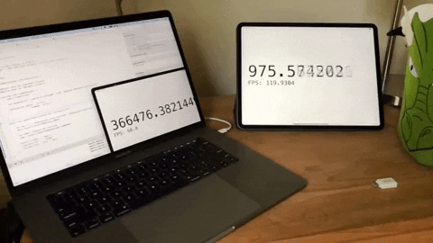

# timer120
Simple iOS app that displays the current CPU time of the device in large text as well as the current FPS of the app. The main loop is syncronized with the refresh rate of the display, making this useful as a time reference in high speed recordings.

It is named "Timer 120" because: 1. an XCode project has to have a name, and 2. the 2018 iPad Pro this was written to run on has a refresh rate of 120Hz. Note that on older iPads or iPhones you may only be able to achieve a 60Hz resolution.

# Purpose
I used this to measure the input/display lag associated with various settings and components in my gaming setup. The basic process was to place the an iPad running this counter in the frame with the game and record a Slo-Mo (240fps) video of the scene with my iPhone. Then, by using iMovie you can move frame-by-frame and calculate the difference between the start frame (indicated by the peak of the sound of the controller button being sharply pressed) and the first frame indicating that the input was processed. The result is a high-resolution stopwatch for iOS with a large enough display so that it's visible in a screen recording.

The results are not as precise as you could get with a dedicated high-resolution timer, but for measuring videogame/consumer simulator lag it's probably good enough.

## Issues / Enhancements
PRs welcome, but note that this software is not being actively maintained. This was built quick-and-dirty as an engineering tool used for a specific purpose. That said, if you find it useful somehow I'd love to hear about how you've used it!
